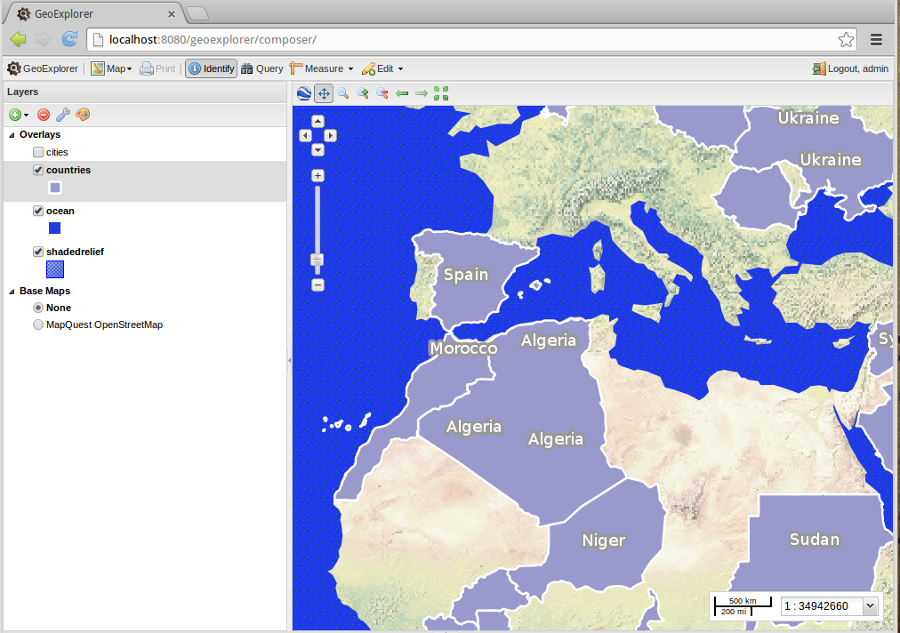
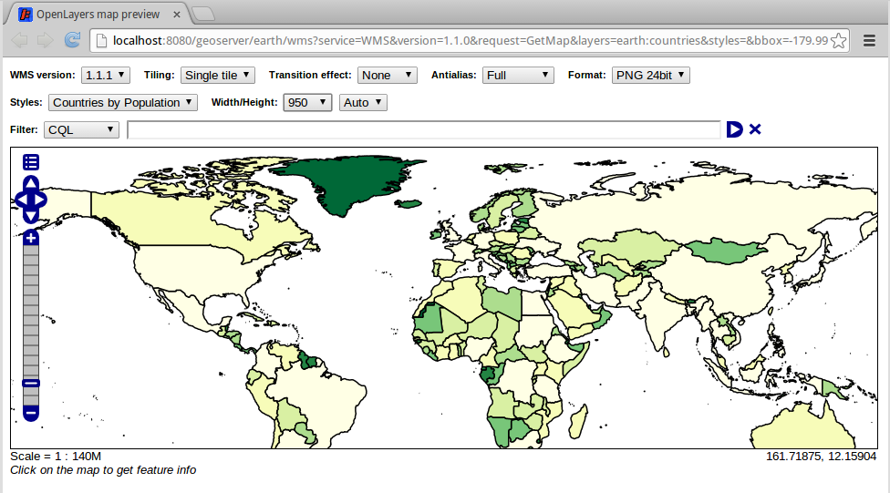

.. _geoserver.styling.geoexplorer:

GeoExplorer
===========

.. note:: GeoExplorer is currently available as part of the OpenGeo Suite.

Creating SLD files by hand can be a difficult and time-consuming process. Fortunately, there is a tool called :guilabel:`GeoExplorer` which is a graphical style editor. With GeoExplorer, you can create rules and symbolizers without ever needing to view SLD code.

.. note:: GeoExplorer currently implements most but not all of the features of the SLD specification.

Installing GeoExplorer
------------------------------

GeoExplorer is an Open Source application available at the OpenGeo suite `source code repository <https://github.com/opengeo/suite>`_. Like GeoServer, it is a Java Enterprise Edition. Building the Web ARchive file of GeoExplorer, even being an easy task for a Java savvy user, is beyond the scope of this workshop.

#. Open a file browser and locate the :file:`software` folder of the workshop materials.

#. Copy the :file:`geoexplorer.war` file into the :file:`/home/user/bin/geoserver-2.3.3/webapps/` folder. That folder is where the servlet container looks for, well, web applications :).

#. Stop your GeoServer instance, remember: :kbd:`Control+C` on the terminal.

#. Start again your GeoServer

#. If you go to `<http://localhost:8080>`_, you should see a link to the GeoExplorer application

   .. figure:: img/gx_installed.png

      Jetty applications list

Using GeoExplorer
-----------------

#. Launch GeoExplorer. By default, GeoExplorer is located at `<http://localhost:8080/geoexplorer>`_.

   .. figure:: img/geoexplorer.png

      GeoExplorer

#. By default, the only layers that display is a MapQuest OpenStreetMap layer. Click the :guilabel:`Add layers` button (the green circle with the white plus) at the top left of the screen and then select :guilabel:`Add layers`.

   .. figure:: img/gx_addlayersbutton.png

      Add layers button

#. In the resulting :guilabel:`Available Layers` dialog, select the four layers used in this workshop (not the ``earthmap`` layer group) and click :guilabel:`Add layers`. To select multiple layers, hold the Ctrl/Cmd key while clicking on the layer.

   .. note:: It may be easier to find the layers by clicking the :guilabel:`id` column to sort by workspace.

   .. figure:: img/gx_addlayersdialog.png

      Selecting layers to add to GeoExplorer

#. Click :guilabel:`Done` to return to the main map. The check boxes determine which layers are being viewed, with the order of the layers determining the rendering order. The layer list also contains an in-line legend for each layer, which is a compilation of all the Rules in the styles of the visible layer. Finally, the bulk of the window is taken up by the map itself.

   .. note:: Layer groups, being a compilation of layers, cannot be styled with GeoExplorer. However, if you edit the style of a layer that is contained in a layer group, the layer group will reflect the change.

   .. figure:: img/gx_layersadded.png

      Layers added to GeoExplorer

#. The layers when added to the map may not be in the correct order. Click to select a layer and drag to reorder the layers until they are in the following order:

   * cities
   * countries
   * ocean
   * shadedrelief

   .. figure:: img/gx_layersreorder.png

      Reordering layers

#. Finally, select :guilabel:`None` under the :guilabel:`Base Maps` list. The map should now look identical to the layer group.

   .. figure:: img/gx_layersreordered.png

      Layers in proper order

Editing an existing style
-------------------------

.. warning:: GeoExplorer makes changes directly to an SLD. An SLD file may look very different after being edited by GeoExplorer. It is always a good idea to make a backup copy of your SLDs before using GeoExplorer.

#. Before we can make any changes to styles, we have to log in to GeoExplorer. Click the login button at the very top right of the window and enter your GeoServer admin credentials:  ``admin`` / ``geoserver`` .

   .. figure:: img/gx_loginbutton.png

      Login button

   .. figure:: img/gx_logindialog.png

      Login dialog

#. Once logged in, the editing tools will be enabled. Select the ``countries`` layer by single clicking on it in the layer list. Then click on the palette icon right above the layer list to Edit Styles.

   .. note:: If the icon is disabled, make sure that you have logged in successfully and that you have selected the correct layer.

   .. figure:: img/gx_editstylesbutton.png

      Click to edit styles

#. A list will display containing all the style rules (in this case, four of them).

   .. figure:: img/gx_listofrules.png

      List of style rules.

#. Click on the first rule and then click :guilabel:`Edit`.

   .. figure:: img/gx_editrulebutton.png

      Click to edit a style rule

#. A style rule editor will display.

   .. figure:: img/gx_editrulebefore.png

      Style rule editor

#. Make some changes to the rule and see how it updates in real time. As a suggestion, change the Fill Color by clicking on the color box and selecting a new color.

   .. figure:: img/gx_colorpicker.png

      Color picker

#. Finally, click :guilabel:`Save` to persist your changes.

   .. figure:: img/gx_editruleafter.png

      Style edited

#. Now take a look at the SLD code that GeoExplorer has created. Navigate back to GeoServer, to the :guilabel:`Styles` menu, and then to the :guilabel:`countries` style to view it.

   .. figure:: img/gx_verify.png

      SLD generated by GeoExplorer showing changed color

Bonus
~~~~~

- Add a new rule that displays the label of the country. Don't worry about label placement. Hint: The attribute to display is called NAME. But if you didn't know this, how would you find it out?

- How might we go about creating an attribute-based classification to draw features within a layer differently based on those features' properties? For example, colour just the countries with a population estimated between 15 and 50 million inhabitants.

   Try to map and label the countries with 15 to 50 million inhabitants.

Bonus software
~~~~~~~~~~~~~~~~~~~~~~

`Atlas Styler <http://en.geopublishing.org/AtlasStyler>`_ is a desktop application to author SLDs. Unfortunately it's discontinued but still useful. Using it is quite straight forward now that you know how to load SLDs into GeoServer:

- Start Atlas Styler
- Connect it to your GeoServer instance
- Load a layer
- Edit the style: create a thematic map, apply scale constraints, compose symbols, etc

  .. figure:: img/atlas_styler.png

     Advanced classification with Atlas Styler

- Copy the SLD to the clipboard
- Paste it in a new GeoServer style
- Assignt it to a layer

   Style applied to the GeoServer layer

