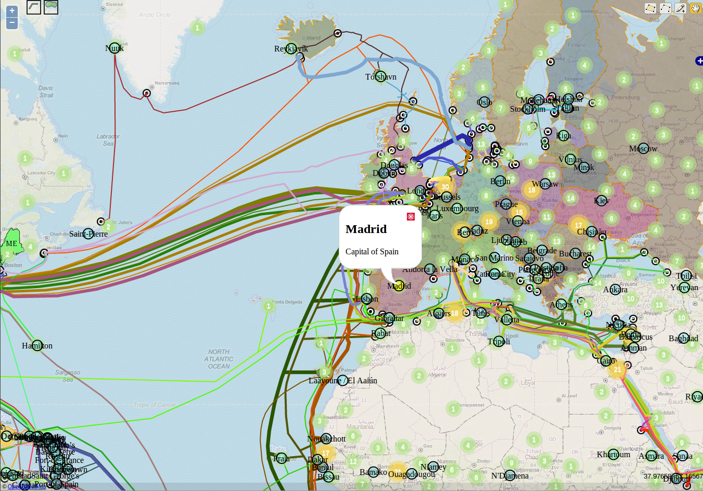

.. module:: openlayers.lab
    :synopsis: Proposal of a complete exercise

.. _openlayers.lab:

Open Layers laboratory
=================================

This is a proposal of a complete exercise that covers the contents learned on this workshop. Take your time to do all the steps.

Basics: Map configuration and controls
--------------------------------------------

.. note:: Estimated duration: 30 minutes

- Set projection to EPSG:900913 and displayProjection to EPSG:4326
- Restrict the map extent of the map to a bounding box (coordinates 
  must be in EPSG:900913)
- Add two raster layers as overlays:
  
  - an Open MapQuest layer
  - The states WMS layer from geoserver

- Set tile size to 512 * 512
- Set the states WMS layer singleTile property to true 
  (see the different labelling options)
- Set the transparency of the MapQuest layer to 50%
- Add the ``layerswitcher`` control
- Avoid the OSM layer to appear in the ``layerswitcher``
- Add the ``zoombox`` control
- Add the ``mouseposition`` control
  
.. note:: Open MapQuest uses this array of OSM urls:
   
   .. code-block:: html

      var arrayOSM = ["http://otile1.mqcdn.com/tiles/1.0.0/osm/${z}/${x}/${y}.jpg",
                      "http://otile2.mqcdn.com/tiles/1.0.0/osm/${z}/${x}/${y}.jpg",
                      "http://otile3.mqcdn.com/tiles/1.0.0/osm/${z}/${x}/${y}.jpg",
                      "http://otile4.mqcdn.com/tiles/1.0.0/osm/${z}/${x}/${y}.jpg"];

Medium: Adding vector layers and advanced controls
------------------------------------------------------

.. note:: Estimated duration: 1 hour

- Add a gml layer with projection: "EPSG:4326".
  Take it from: :file:`data/europe.gml`
- Add a kml layer with projection: "EPSG:4326".
  Take it from :file:`data/global_undersea.kml`
- Add two wfs layers (polygons and points) with projection: "EPSG:4326":
  ``cartaro:capitals`` and ``topp:states``.
- Add the editing toolbar
- Change the position and/or theme of the ``layerswitcher``
- Add the ``DynamicMeasure`` control from the extras folder. 
  Configure it to measure distances and areas
- Add buttons for switching distance and area measure controls.
  You will need to add an ``OpenLayers.Control.Panel``, and define 
  the ``displayClass`` of the ``DynamicMeasureControl``. Also create those 
  styles with CSS
- Add the ``FeaturePopup`` control from the extras folder and 
  configure it for the cities layer You'll need to define templates. 
  See the documentation of the ``FeaturePopup`` Control

Advanced: Styling
------------------

.. note:: Estimated duration: 2 hours

- Filter wfs: Filter countries of the states layer with a ``MALE``
  population greater than ``700000``
- Set the stylemap of the citiesLayer:
  
  - Add a ``default`` and a ``select`` style, 
    a ``label`` and ``fillColors``

- Register to the ``featureselected`` event of the states layer and 
  show an alert with the ``ID`` of the feature
- Create a function to add unique values styles to a layer given its name 
  and a feature attribute name. Apply it to the gml layer, with the 
  property ``UN``
- Use a ``AnimatedClusterStrategy`` in the points layer
- Rules

   Result of the laboratory