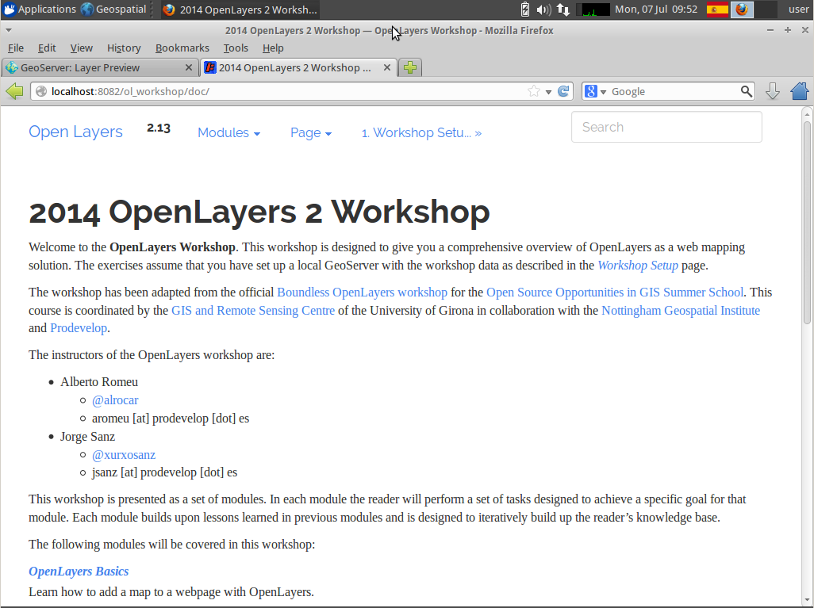

.. _openlayers.setup:

Workshop Setup
==============

Prerequisites
---------------

This workshop assumes that you are runnig `OSGeo Live 7.9 <http://live.osgeo.org>`_. Anyway these instructions can be adapted to any regular `GeoServer <http://www.geoserver.org>`_ installation, as it uses the standard sample data that comes with any recent GeoServer binaries.

The OSGeo Live distribution uses the port **8082** for GeoServer. To start and stop GeoServer you have to go to the menu :menuselection:`Geospatial --> Web Services --> GeoServer`.

Deploying the Workshop Docs
---------------------------

* Open a Terminal using the menu: :menuselection:`Applications --> Accesories --> Terminal Emulator`.

* Grant you access to the GeoServer :file:`webapps` folder::

    user@osgeolive:~$ sudo chmod 777 /usr/local/lib/geoserver-2.4.4/webapps

* Download the :file:`ol_workshop.zip` file and extract it on the :file:`webapps` folder.
  
  .. image:: unzip-workshop.png
     :align: center
     :alt: Unzip the workshop folder

* Start GeoServer going to the menu :menuselection:`Geospatial --> Web Services --> GeoServer --> Start GeoServer`.
  
  .. image:: geoserver-menu.png
   :align: center
   :alt: GeoServer control

Test the Setup
--------------

Test GeoServer setup:

#. Load http://localhost:8082/geoserver/ in a browser. You should see GeoServer's welcome screen.
#. Navigate to the layers preview page. You should be able to see the medford layers listed in the table.
#. Click on the OpenLayers preview link for the ``tiger-ny`` group layer. You should see the Manhattan island with streets and some points.

   .. image:: tiger-ny.png
      :align: center
      :alt: GeoServer TIGER data

#. Test Workshop Docs. Load http://localhost:8082/ol_workshop/doc/ in a browser. You should see a the intro page for the workshop docs with links to lead you through the workshop.

   
