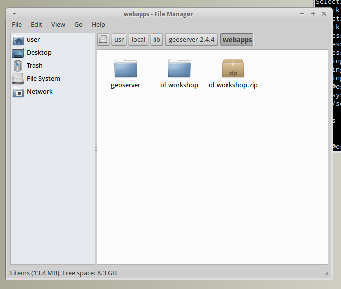

Workshop Setup
==============

Prerequisites
---------------

This workshop assumes that you are runnig `OSGeo Live 7.9 <http://live.osgeo.org>`_. Anyway these instructions can be adapted to any regular `GeoServer <http://www.geoserver.org>`_ installation, as it uses the standard sample data that comes with any recent GeoServer binaries.

The OSGeo Live distribution uses the port **8082** for GeoServer. To start and stop GeoServer you have to go to the menu :menuselection:`Geospatial --> Web Services --> GeoServer`.

Deploying the Workshop Docs
---------------------------

* Extract the :file:`ol_workshop.zip` archive to the user folder at :file:`/home/user`.

* Open a Terminal with :menuselection:`Applications --> Accesories --> Terminal Emulator`. (**REVIEW**)

* Create a symbolic link from the workshop folder to the GeoServer :file:`webapps` folder::
  
  	(**REVIEW**)
    user$ sudo ln -s /home/user/ol_workshop /usr/local/geoserver/webapps 

* Check using a file browser that you can navigate into the :file:`/usr/local/geoserver/webapps/ol_workshop` folder.

* Start GeoServer going to the menu :menuselection:`Geospatial --> Web Services --> GeoServer --> Start GeoServer`.

Test the Setup
--------------

Test GeoServer setup:

#. Load @geoserver_url@/ in a browser. You should see GeoServer's welcome screen.
#. Navigate to the layers preview page. You should be able to see the medford layers listed in the table.
#. Click on the OpenLayers preview link for the ``medford`` layer. You should see some elevation data with infrastructure data over it.
   

**REVIEW**: add screenshot

Test Workshop Docs:

#. Load http://localhost:8082/ol_workshop/doc/ in a browser. You should see a the intro page for the workshop docs with links to lead you through the workshop.

**REVIEW**: add screenshot