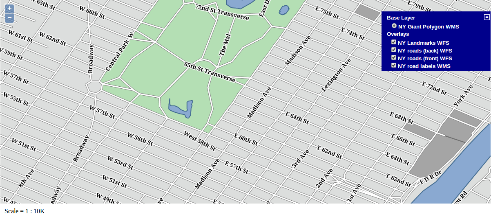

.. _openlayers.style:

Styling Vector Layers
=====================

#.  We'll start with a working example that displays building footprints in a vector layer over a base layer.  Open your text editor and save the following as ``map.html`` in the root of your workshop directory:

    .. code-block:: html

        <!DOCTYPE html>
        <html>
            <head>
                <title>My Map</title>
                <link rel="stylesheet" href="openlayers/theme/default/style.css" type="text/css">
                
                

            </head>
            <body>
                <h1>My Map</h1>
                

                
            </body>
        </html>

#.  Open this ``map.html`` file in your browser to see orange landmarks over  the base layer:  http://localhost:8082/ol_workshop/map.html. You can use the layer switcher control we added to change the visibility of the vector layer.

#.  With a basic understanding of :ref:`styling in OpenLayers <openlayers.vector.style-intro>`, we can create an ``OpenLayers.StyleMap`` that displays landmarks in different colors based on the ``CFCC`` code. In your map initialization code, replace the constructor for the ``landmarks`` layer with the following:

    .. code-block:: javascript

        var landmarks = new OpenLayers.Layer.Vector("NY Landmarks", {
            strategies: [new OpenLayers.Strategy.BBOX()],
            protocol: new OpenLayers.Protocol.WFS({
                version: "1.1.0",
                url: "/geoserver/wfs",
                featureType: "poly_landmarks",
                featureNS: "http://www.census.gov",
                srsName: "EPSG:4326"
            }),
            styleMap: new OpenLayers.StyleMap({
                "default": new OpenLayers.Style({
                    strokeColor: "white",
                    strokeWidth: 1
                }, {
                    rules: [
                        new OpenLayers.Rule({
                             filter: new OpenLayers.Filter.Logical({
                                type: OpenLayers.Filter.Logical.OR,
                                filters: [
                                    new OpenLayers.Filter.Comparison({
                                        type: OpenLayers.Filter.Comparison.EQUAL_TO,
                                        property: "CFCC", value: "D82"
                                    }),
                                    new OpenLayers.Filter.Comparison({
                                        type: OpenLayers.Filter.Comparison.EQUAL_TO,
                                        property: "CFCC", value: "D83"
                                    }),
                                    new OpenLayers.Filter.Comparison({
                                        type: OpenLayers.Filter.Comparison.EQUAL_TO,
                                        property: "CFCC", value: "D84"
                                    }),
                                    new OpenLayers.Filter.Comparison({
                                        type: OpenLayers.Filter.Comparison.EQUAL_TO,
                                        property: "CFCC", value: "D85"
                                    })
                                ]
                            }),
                            symbolizer: {
                                fillColor: "#B4DFB4",
                                strokeColor: "#88B588",
                                strokeWidth: 2
                            }
                        }),
                        new OpenLayers.Rule({
                            elseFilter: true,
                            symbolizer: {
                                fillColor: "navy"
                            }
                        })
                    ]
                })
            })
        });

#. See how an ``OpenLayers.Filter.Logical.OR`` filter groups several filters to allow a rule to match different conditions. That is, style all the features where the field ``CFCC` has the values ``D80`` to ``D85``.

#.  Save your changes and open ``map.html`` in your browser: http://localhost:8082/ol_workshop/map.html

    .. figure:: style1.png

       Landmarks related with green areas.

.. rubric:: Tasks

#. Go to the GeoServer web interface and review the SLD style applied to the ``poly_landmarks``. You'll see the first rule is similar to the style applied on this exercise.

#. Try to reproduce the rest of the rules of the layer, so you have a similar vector representation of this WMS layer.

#. Change the base layer to just load the ``giant_polygon`` WMS layer and try to render the roads as vectors using filter by scale, and loading on top the labels as a WMS layer. You will have to create a new SLD style to just render the labels. Pay attention to the image below layers to see how to obtain that effect.

   Rendering landmarks and roads as vectors